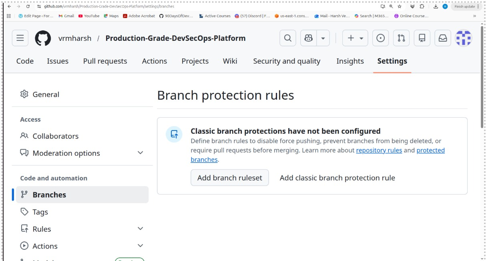
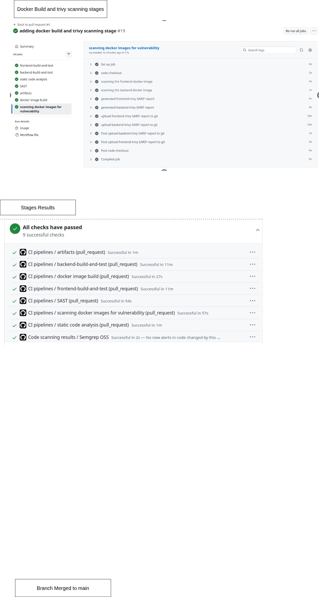
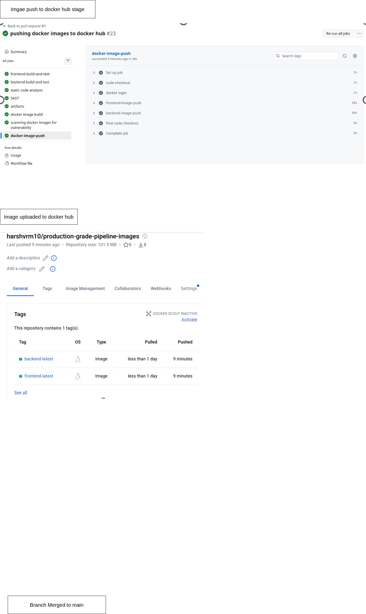
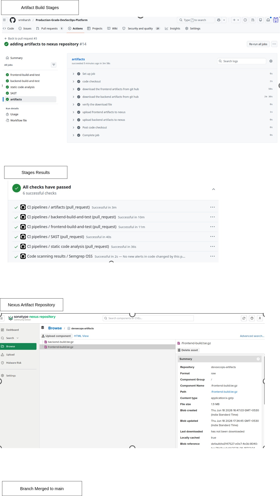
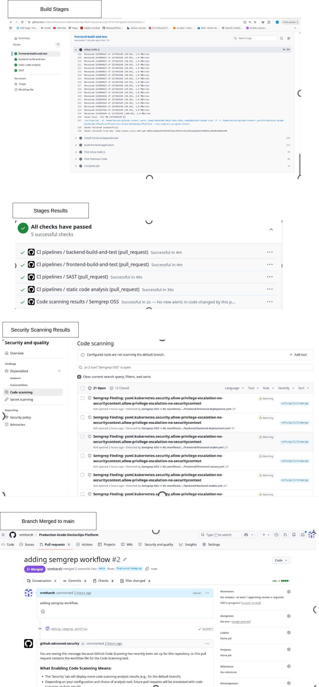
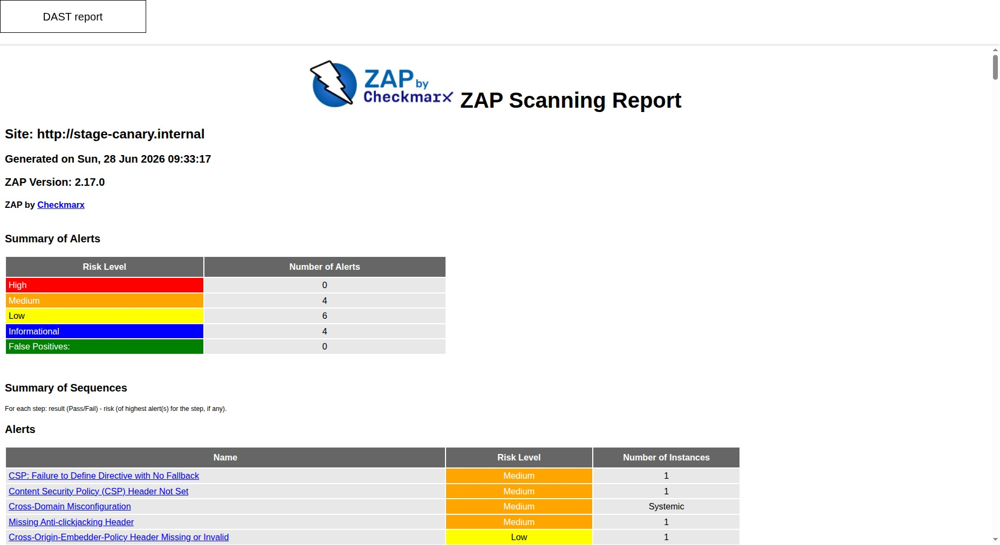
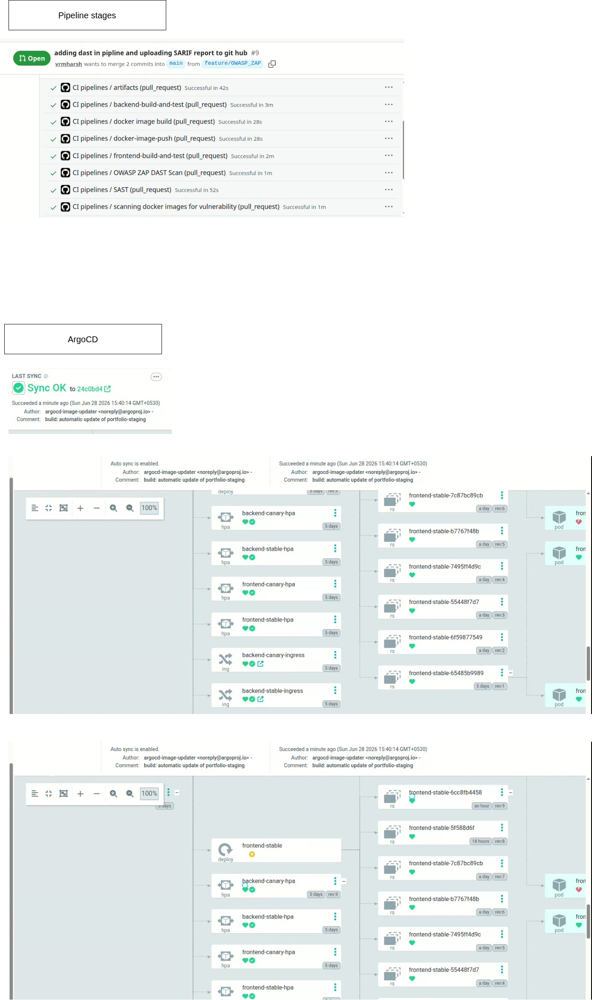

Production-Grade DevSecOps Platform

A production-inspired DevSecOps platform demonstrating an end-to-end CI/CD pipeline using GitHub Actions, Docker, Kubernetes, GitOps, security scanning, and observability.

The project automates the complete software delivery lifecycle from source code commit to production deployment while integrating DevSecOps best practices such as SAST, container vulnerability scanning, DAST, artifact management, GitOps deployments, and production-grade monitoring.

## Architecture

[Architecture](pipeline-stage-images/architecture.jpg)

## Project Overview

```text
Developer
      │
      ▼
GitHub Repository
      │
      ▼
GitHub Actions Pipeline
      │
      ├── Build
      ├── SonarQube
      ├── Semgrep
      ├── Docker Build
      ├── Trivy Scan
      ├── Push Docker Images
      ├── Nexus Artifact Upload
      ▼
GitOps Repository
      ▼
ArgoCD
      ▼
Kubernetes
      ▼
OWASP ZAP
      ▼
Observability Stack
```

## Technology Stack

| Category | Technologies |
|-----------|--------------|
| CI/CD | GitHub Actions |
| Languages | JavaScript, Node.js, React |
| Containers | Docker |
| Kubernetes | Helm |
| GitOps | ArgoCD, ArgoCD Image Updater |
| Code Quality | SonarQube |
| SAST | Semgrep |
| Container Security | Trivy |
| DAST | OWASP ZAP |
| Artifact Repository | Nexus |
| Registry | Docker Hub |
| Monitoring | Prometheus, Grafana |
| Logging | Loki |
| Tracing | Tempo, OpenTelemetry |
| Alerting | Alertmanager, Slack |


## Repository Structure

Pipeline Stages:

Branch Protection



Docker Build & Trivy Scan


Docker Push


Nexus Artifact Repository


Semgrep Security Scan


OWASP ZAP DAST Report


ArgoCD Deployment



## Deployment Flow

```text
Code Commit
      │
      ▼
GitHub Actions
      │
      ▼
Security Scans
      │
      ▼
Docker Images
      │
      ▼
Docker Hub
      │
      ▼
ArgoCD Image Updater
      │
      ▼
GitOps Repository
      │
      ▼
ArgoCD
      │
      ▼
Kubernetes
      │
      ▼
Monitoring Stack
```

## Security Considerations

- GitHub Secrets
- Branch Protection Rules
- SonarQube Code Quality
- Semgrep SAST
- Trivy Container Scanning
- OWASP ZAP DAST
- Kubernetes Secrets
- Secret Templates
- GitHub Push Protection


## Author
Harsh Verma

DevOps | Cloud Native | Kubernetes | Observability | DevSecOps