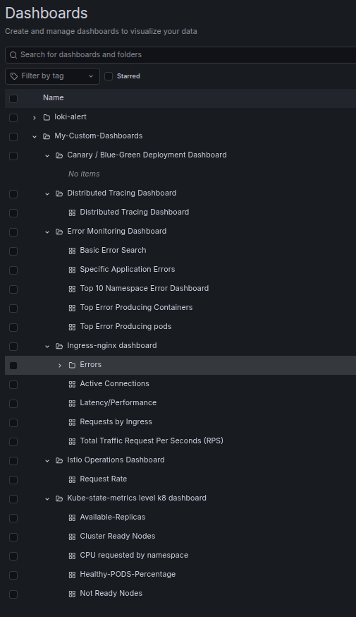
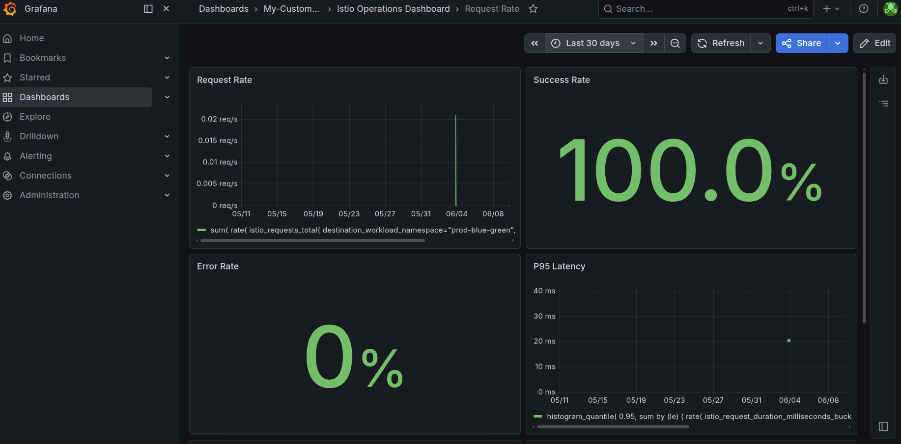
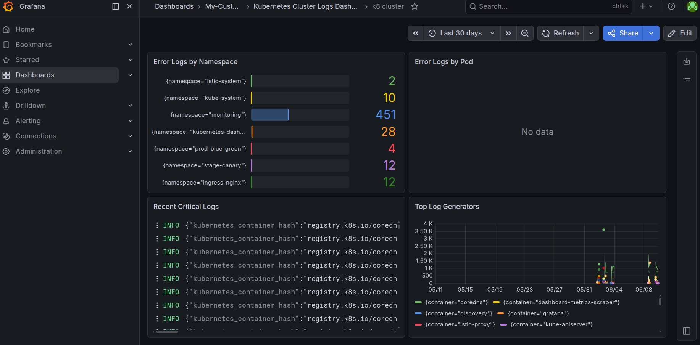
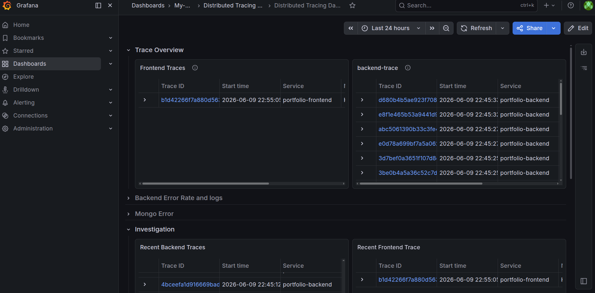
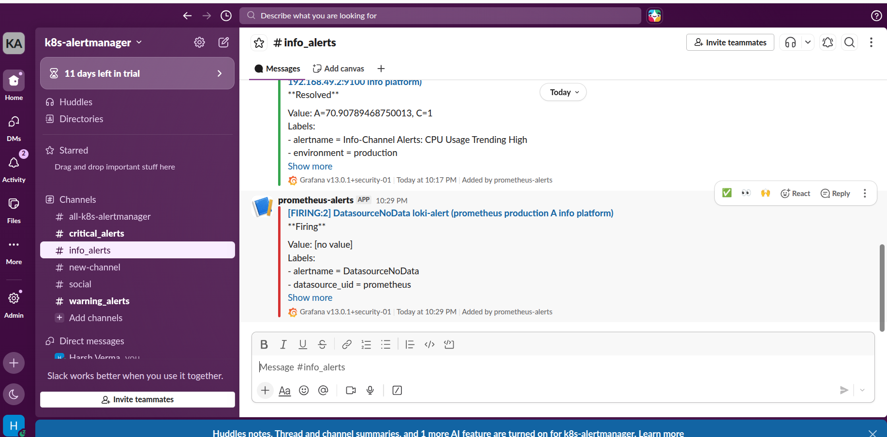

# Kubernetes Observability Platform

A production-style Kubernetes observability platform built to demonstrate modern cloud-native monitoring, logging, distributed tracing, alerting, and service mesh capabilities.

This project simulates how observability is implemented in real-world Kubernetes environments by integrating Prometheus, Grafana, Loki, Tempo, OpenTelemetry, Alertmanager, Fluent Bit, and Istio Service Mesh.


# Project Overview

This platform provides end-to-end observability for containerized applications running on Kubernetes.

The solution covers:

* Metrics Collection
* Centralized Logging
* Distributed Tracing
* Alert Management
* Service Mesh Observability
* Traffic Management
* Deployment Strategies

The objective was to build a production-inspired monitoring stack that provides complete visibility into application and infrastructure behavior.

---

# Technology Stack

| Category                   | Tools                              |
| -------------------------- | ---------------------------------- |
| Container Orchestration    | Kubernetes (Minikube)              |
| Metrics                    | Prometheus                         |
| Visualization              | Grafana                            |
| Log Aggregation            | Loki                               |
| Log Collection             | Fluent Bit                         |
| Distributed Tracing        | Tempo                              |
| Instrumentation            | OpenTelemetry                      |
| Alerting                   | Alertmanager                       |
| Notifications              | Slack                              |
| Service Mesh               | Istio                              |
| Service Mesh Visualization | Kiali                              |
| Deployment Strategies      | Rolling Update, Blue-Green, Canary |
| Application                | Node.js, React                     |
| Containerization           | Docker                             |

---

# Features

## Metrics Monitoring

* Infrastructure metrics collection
* Node monitoring
* Pod monitoring
* Namespace monitoring
* Resource utilization tracking
* Application metrics collection
* Prometheus-based scraping

### Components

* Prometheus
* kube-state-metrics
* cAdvisor
* Node Exporter
* Grafana

---

## Centralized Logging

Application and cluster logs are aggregated into a centralized logging platform.

### Log Flow

```text
Application Pods
       |
       v
   Fluent Bit
       |
       v
      Loki
       |
       v
    Grafana
```

### Capabilities

* Pod log aggregation
* Namespace filtering
* Structured log analysis
* Centralized troubleshooting

---

## Distributed Tracing

Distributed tracing is implemented using OpenTelemetry and Tempo.

### Trace Flow

```text
Application
      |
      v
OpenTelemetry SDK
      |
      v
OpenTelemetry Collector
      |
      v
     Tempo
      |
      v
    Grafana
```

### Capabilities

* Request tracing
* Service dependency visibility
* Latency analysis
* Bottleneck identification

---

## Alerting Platform

Alertmanager is configured to route alerts based on severity levels.

### Alert Severity Levels

| Severity | Destination            |
| -------- | ---------------------- |
| Critical | Slack Critical Channel |
| Warning  | Slack Warning Channel  |
| Info     | Slack Info Channel     |

### Alert Sources

* Pod Failures
* Container Restarts
* High CPU Usage
* High Memory Usage
* Node Health Issues
* Kubernetes Events

---

## Service Mesh

Istio Service Mesh provides advanced traffic management and observability.

### Implemented Features

* Traffic Routing
* Service Discovery
* Request Monitoring
* Distributed Tracing Integration
* Telemetry Collection
* Kiali Visualization

### Observability Integration

```text
Istio
  |
  +--> Prometheus
  |
  +--> Grafana
  |
  +--> Kiali
  |
  +--> Tempo
```

---

# Deployment Strategies

The platform demonstrates multiple deployment approaches commonly used in production environments.

## Rolling Update

* Zero downtime deployment
* Progressive pod replacement

## Blue-Green Deployment

* Instant rollback capability
* Production-safe releases

## Canary Deployment

* Controlled traffic shifting
* Risk reduction during releases

---

# Repository Structure

```text
.
├── backend/
├── frontend/
├── k8_manifests/
│   ├── rollingUpdate/
│   ├── blue-green/
│   ├── canary/
│   ├── istio/
│   └── otel-ingress/
│
├── monitoring/
│   ├── prometheus/
│   ├── grafana/
│   ├── loki/
│   ├── fluent-bit/
│   ├── distributed-tracing/
│   └── alertmanager/
│
├── docs/
│   └── architecture/
│
└── README.md
```

---

# Dashboards

The platform includes dashboards for:

* Kubernetes Cluster Health
* Node Monitoring
* Namespace Monitoring
* Pod Monitoring
* Resource Utilization
* Application Metrics
* Distributed Tracing
* Log Analytics

---

# Security Considerations

Sensitive values are excluded from source control.

Examples include:

* Slack Webhooks
* Application Secrets
* API Keys
* Credentials

In production environments, these secrets would typically be managed through:

* Kubernetes Secrets
* External Secrets Operator
* AWS Secrets Manager
* HashiCorp Vault

---

# Screenshots

## Grafana Dashboards




## Istio-Dashboard



## Kubernetes-Dashboard



## Distributed-Tracing-Dashboard.png



## Slack Alerts




---

# Learning Outcomes

This project provided hands-on experience with:

* Kubernetes Administration
* Cloud Native Observability
* Prometheus Monitoring
* Grafana Dashboards
* Distributed Tracing
* OpenTelemetry
* Service Mesh Architecture
* Production Alerting
* Traffic Management
* Deployment Strategies

---

# Author

**Harsh Verma**

DevOps | Cloud Native | Kubernetes | Observability
